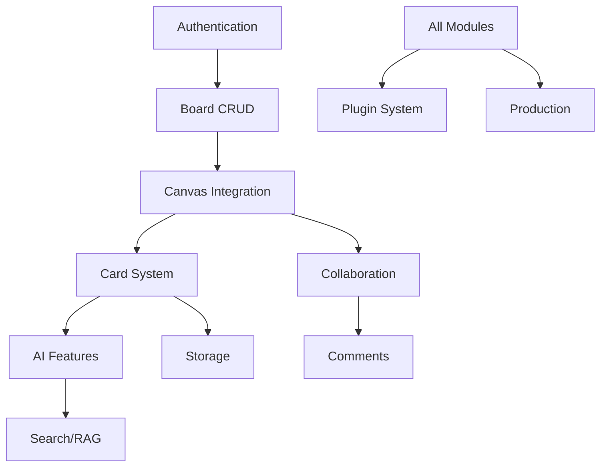

# RAGBOARD Implementation Summary & Effort Estimates

## 📊 Executive Summary

RAGBOARD is a comprehensive AI-powered research and ideation canvas platform that combines:
- **Infinite Canvas**: Excalidraw-based visual workspace
- **Multi-media Cards**: Text, images, video, documents, and audio
- **AI Integration**: LangChain-powered RAG with semantic search
- **Real-time Collaboration**: Y.js and PartyKit for live editing
- **Extensible Architecture**: Plugin system for custom tools

**Total Estimated Effort**: 480-640 developer hours (12-16 weeks with 2-4 developers)

## 💰 Effort Breakdown by Phase

### Phase 1: Foundation (120-160 hours)
```
Authentication & Setup:     40 hours
Database & API:            40 hours  
Excalidraw Integration:    40 hours
Basic UI Components:       20 hours
Testing Setup:            20 hours
```

### Phase 2: Card System (100-130 hours)
```
Card Architecture:         30 hours
Text/Image Cards:         20 hours
Video/Audio Cards:        30 hours
Document Cards:           20 hours
Drag & Drop System:       15 hours
Performance Optimization:  15 hours
```

### Phase 3: AI Integration (140-180 hours)
```
LangChain Setup:          30 hours
Vector Store (Chroma):    20 hours
RAG Pipeline:             40 hours
Whisper Integration:      20 hours
Chat Interface:           30 hours
Content Processing:       20 hours
Search & Indexing:        20 hours
```

### Phase 4: Real-time Collaboration (80-100 hours)
```
Y.js Integration:         30 hours
PartyKit Setup:          20 hours
Live Cursors/Presence:    15 hours
Conflict Resolution:      15 hours
Comments System:          20 hours
```

### Phase 5: Integrations & Plugins (40-50 hours)
```
External APIs:            20 hours
Plugin Architecture:      15 hours
SDK Documentation:        10 hours
Security & Testing:       5 hours
```

### Phase 6: Production Ready (40-50 hours)
```
Comprehensive Testing:    15 hours
Performance Optimization: 10 hours
Documentation:           10 hours
Deployment Setup:         5 hours
Launch Preparation:       5 hours
```

## 🏗️ Module Dependencies



## 📁 Deliverable Structure

### Phase 1 Deliverables
- ✅ Working authentication flow
- ✅ Board creation and management
- ✅ Basic Excalidraw canvas
- ✅ Persistent storage
- ✅ Initial test suite

### Phase 2 Deliverables  
- ✅ All 5 card types functional
- ✅ Drag and drop system
- ✅ Media upload/storage
- ✅ Rich text editing
- ✅ Card interactions

### Phase 3 Deliverables
- ✅ AI chat interface
- ✅ RAG pipeline operational
- ✅ Content indexing
- ✅ Semantic search
- ✅ Transcription services

### Phase 4 Deliverables
- ✅ Real-time sync
- ✅ Multi-user presence
- ✅ Collaborative editing
- ✅ Comment threads
- ✅ Activity tracking

### Phase 5 Deliverables
- ✅ Social media integrations
- ✅ Plugin system
- ✅ Developer SDK
- ✅ Example plugins
- ✅ API documentation

### Phase 6 Deliverables
- ✅ Production-ready build
- ✅ Deployment pipeline
- ✅ Monitoring setup
- ✅ User documentation
- ✅ Launch materials

## 🎯 Risk Assessment & Mitigation

### High Risk Items
1. **Excalidraw Customization** (Risk: High)
   - Mitigation: Early spike, fallback options
   - Buffer: +1 week

2. **Real-time Performance** (Risk: High)
   - Mitigation: Load testing, optimization cycles
   - Buffer: +1 week

3. **AI Token Costs** (Risk: Medium)
   - Mitigation: Caching, rate limiting
   - Buffer: Cost monitoring from day 1

### Medium Risk Items
1. **Y.js Complexity** (Risk: Medium)
   - Mitigation: Incremental implementation
   - Buffer: +3 days

2. **Plugin Security** (Risk: Medium)
   - Mitigation: Sandboxing, review process
   - Buffer: +2 days

## 👥 Recommended Team Structure

### Core Team (Minimum)
- **Tech Lead**: Architecture, code reviews, integration
- **Frontend Dev**: React, Canvas, UI components  
- **Backend Dev**: APIs, database, AI integration
- **Full Stack Dev**: Features, testing, deployment

### Extended Team (Optimal)
- **UI/UX Designer**: Design system, user flows
- **AI Engineer**: LangChain, optimization
- **DevOps Engineer**: Infrastructure, monitoring
- **QA Engineer**: Test automation, quality

## 💡 Key Success Factors

### Technical Excellence
- Modular architecture for maintainability
- Comprehensive testing (>80% coverage)
- Performance budgets enforced
- Security-first approach

### Developer Experience
- Clear documentation
- Consistent code style
- Automated workflows
- Fast feedback loops

### User Experience
- Intuitive interface
- Fast performance
- Reliable sync
- Helpful AI

## 🚀 Quick Start Path

### Week 1 Sprint
1. Setup development environment
2. Initialize project structure
3. Implement authentication
4. Create first board
5. Integrate basic canvas

### MVP Features (4 weeks)
- User auth ✓
- Board CRUD ✓
- Canvas with save ✓
- Text cards ✓
- Basic AI chat ✓

### Beta Features (8 weeks)
- All card types ✓
- Full AI RAG ✓
- Basic collaboration ✓
- Export functionality ✓

### Launch Features (12-16 weeks)
- Complete feature set ✓
- Performance optimized ✓
- Production ready ✓
- Documentation complete ✓

## 📈 Scaling Considerations

### Performance Targets
- Support 100+ elements per board
- Handle 50+ concurrent users
- Sub-second sync latency
- 99.9% uptime

### Infrastructure Needs
- CDN for global distribution
- Horizontal scaling for APIs
- Dedicated AI inference servers
- Robust backup strategy

## 🔗 Integration Priorities

### Phase 1-2: Core Integrations
- Supabase (auth)
- PostgreSQL (data)
- MinIO (storage)
- Excalidraw (canvas)

### Phase 3-4: AI & Collab
- OpenAI (LLMs)
- Chroma (vectors)
- PartyKit (WebSocket)
- Y.js (CRDT)

### Phase 5-6: External
- Social APIs
- Cloud storage
- Analytics
- Monitoring

## ✅ Definition of Done

Each phase is complete when:
1. All features implemented
2. Tests written and passing
3. Documentation updated
4. Code reviewed and merged
5. Deployed to staging
6. Stakeholder approval

---

This implementation plan provides a clear path from concept to production-ready RAGBOARD platform with realistic timelines and comprehensive feature coverage.