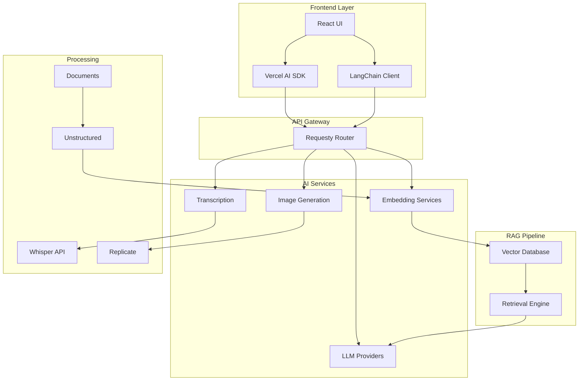

# 🤖 RAGBOARD AI Features & Integration Specification

## 🎯 AI Vision & Strategy

RAGBOARD leverages AI to transform visual knowledge mapping into an intelligent research and ideation platform. The AI system provides context-aware assistance, automated content processing, and semantic understanding of relationships between ideas.

## 🏗️ AI Architecture Overview



## 🧠 Core AI Components

### 1. Requesty API Router
**Purpose**: Centralized LLM request routing and management

```typescript
interface RequestyConfig {
  providers: {
    anthropic: { apiKey: string, models: string[] }
    openai: { apiKey: string, models: string[] }
    google: { apiKey: string, models: string[] }
    replicate: { apiKey: string, models: string[] }
  }
  routing: {
    default: 'anthropic/claude-3-sonnet'
    fallback: ['openai/gpt-4', 'google/gemini-pro']
    specialized: {
      code: 'anthropic/claude-3-opus'
      creative: 'openai/gpt-4-turbo'
      analysis: 'google/gemini-ultra'
    }
  }
  rateLimit: {
    requests: 100
    window: '1h'
    burst: 20
  }
}
```

### 2. LangChain Integration
**Purpose**: Orchestrate complex AI workflows and chains

#### Core Chains
```python
# backend/app/modules/ai/chains/

# 1. Conversational RAG Chain
from langchain.chains import ConversationalRetrievalQAChain
from langchain.memory import ConversationSummaryBufferMemory

class BoardRAGChain:
    """Context-aware Q&A using board content"""
    def __init__(self, vectorstore, llm):
        self.memory = ConversationSummaryBufferMemory(
            memory_key="chat_history",
            return_messages=True,
            max_token_limit=2000
        )
        self.chain = ConversationalRetrievalQAChain.from_llm(
            llm=llm,
            retriever=vectorstore.as_retriever(
                search_kwargs={"k": 5}
            ),
            memory=self.memory,
            combine_docs_chain_kwargs={
                "prompt": BOARD_QA_PROMPT
            }
        )

# 2. Content Generation Chain
class ContentGenerationChain:
    """Generate various content types"""
    chains = {
        "summary": SummarizationChain,
        "expand": ExpansionChain,
        "critique": CritiqueChain,
        "brainstorm": BrainstormChain
    }

# 3. Multi-Modal Analysis Chain
class MultiModalChain:
    """Analyze images, videos, documents"""
    processors = {
        "image": ImageCaptionChain,
        "video": VideoAnalysisChain,
        "document": DocumentQAChain
    }
```

### 3. Vector Store & Embeddings
**Purpose**: Semantic search and context retrieval

#### ChromaDB Configuration
```python
# backend/app/modules/rag/vectordb/chroma_config.py

import chromadb
from chromadb.config import Settings

class ChromaDBManager:
    def __init__(self):
        self.client = chromadb.PersistentClient(
            path="./chroma_db",
            settings=Settings(
                anonymized_telemetry=False,
                allow_reset=True
            )
        )
    
    def create_collections(self):
        # Collection per board for isolation
        return {
            "nodes": self.client.create_collection(
                name="board_nodes",
                metadata={"hnsw:space": "cosine"},
                embedding_function=OpenAIEmbeddingFunction()
            ),
            "documents": self.client.create_collection(
                name="board_documents",
                metadata={"hnsw:space": "cosine"}
            ),
            "conversations": self.client.create_collection(
                name="board_conversations",
                metadata={"hnsw:space": "cosine"}
            )
        }
```

#### Embedding Pipeline
```python
# backend/app/modules/rag/embeddings/pipeline.py

class EmbeddingPipeline:
    def __init__(self, embedding_model="text-embedding-3-small"):
        self.embedder = OpenAIEmbeddings(model=embedding_model)
        self.text_splitter = RecursiveCharacterTextSplitter(
            chunk_size=1000,
            chunk_overlap=200
        )
    
    async def process_node(self, node: Node):
        """Extract and embed node content"""
        # Extract text based on node type
        text = await self.extract_text(node)
        
        # Split into chunks
        chunks = self.text_splitter.split_text(text)
        
        # Generate embeddings
        embeddings = await self.embedder.aembed_documents(chunks)
        
        # Store with metadata
        metadata = {
            "node_id": node.id,
            "node_type": node.type,
            "board_id": node.board_id,
            "created_at": node.created_at,
            "chunk_index": list(range(len(chunks)))
        }
        
        return chunks, embeddings, metadata
```

### 4. AI-Powered Features

#### A. Smart Content Suggestions
```typescript
// src/modules/ai/suggestions/contentSuggestions.ts

interface ContentSuggestion {
  type: 'related' | 'missing' | 'next_step' | 'question'
  content: string
  confidence: number
  reasoning: string
}

class SmartSuggestions {
  async analyzeBoard(boardId: string): Promise<ContentSuggestion[]> {
    // Analyze current board content
    const nodes = await getNodesForBoard(boardId)
    const embeddings = await generateEmbeddings(nodes)
    
    // Find content gaps
    const gaps = await findContentGaps(embeddings)
    
    // Generate suggestions
    const suggestions = await llm.generate({
      prompt: SUGGESTION_PROMPT,
      context: { nodes, gaps }
    })
    
    return suggestions
  }
}
```

#### B. Semantic Node Connections
```python
# backend/app/modules/ai/connections/semantic_linker.py

class SemanticLinker:
    def __init__(self, threshold=0.7):
        self.threshold = threshold
        self.vectorstore = ChromaDB()
    
    async def find_connections(self, node_id: str):
        """Find semantically related nodes"""
        # Get node embedding
        node_embedding = await self.vectorstore.get_embedding(node_id)
        
        # Search for similar nodes
        similar = await self.vectorstore.similarity_search(
            embedding=node_embedding,
            k=10,
            filter={"node_id": {"$ne": node_id}}
        )
        
        # Filter by threshold and generate explanations
        connections = []
        for match in similar:
            if match.score >= self.threshold:
                explanation = await self.explain_connection(
                    source_id=node_id,
                    target_id=match.id
                )
                connections.append({
                    "target": match.id,
                    "score": match.score,
                    "explanation": explanation
                })
        
        return connections
```

#### C. Intelligent Summarization
```typescript
// src/modules/ai/summarization/boardSummarizer.ts

class BoardSummarizer {
  async generateSummary(boardId: string, options: SummaryOptions) {
    const nodes = await fetchBoardNodes(boardId)
    
    // Hierarchical summarization
    const clusterSummaries = await this.summarizeClusters(nodes)
    const themeSummary = await this.extractThemes(clusterSummaries)
    const executiveSummary = await this.createExecutiveSummary(themeSummary)
    
    return {
      executive: executiveSummary,
      themes: themeSummary,
      clusters: clusterSummaries,
      keyInsights: await this.extractKeyInsights(nodes),
      nextSteps: await this.suggestNextSteps(nodes)
    }
  }
}
```

#### D. Conversational AI Assistant
```typescript
// src/components/ai/AIChatInterface.tsx

interface AIChatConfig {
  model: 'claude-3' | 'gpt-4' | 'gemini'
  temperature: number
  maxTokens: number
  useRAG: boolean
  includeWebSearch: boolean
}

const AIChatInterface: React.FC = () => {
  const { messages, sendMessage, isLoading } = useAIChat({
    api: '/api/chat',
    onError: (error) => console.error('Chat error:', error),
    streamMode: true
  })
  
  const handleSendMessage = async (content: string) => {
    // Add context from current board
    const context = await gatherBoardContext()
    
    await sendMessage({
      content,
      context,
      config: {
        useRAG: true,
        temperature: 0.7
      }
    })
  }
  
  return (
    <ChatContainer>
      <MessageList messages={messages} />
      <ChatInput onSend={handleSendMessage} />
      <AIToolbar>
        <QuickActions />
        <ModelSelector />
        <ContextIndicator />
      </AIToolbar>
    </ChatContainer>
  )
}
```

### 5. Document Processing Pipeline

#### PDF Processing
```python
# backend/app/modules/processing/pdf/extractor.py

from unstructured.partition.pdf import partition_pdf
from unstructured.chunking.title import chunk_by_title

class PDFProcessor:
    async def process(self, file_path: str):
        # Extract elements with layout understanding
        elements = partition_pdf(
            filename=file_path,
            strategy="hi_res",  # High resolution for better accuracy
            extract_images_in_pdf=True,
            infer_table_structure=True
        )
        
        # Chunk intelligently by sections
        chunks = chunk_by_title(
            elements,
            max_characters=1000,
            new_after_n_chars=800
        )
        
        # Extract metadata
        metadata = {
            "pages": len(set(el.metadata.page_number for el in elements)),
            "tables": sum(1 for el in elements if el.category == "Table"),
            "images": sum(1 for el in elements if el.category == "Image"),
            "sections": self.extract_sections(elements)
        }
        
        return {
            "chunks": chunks,
            "metadata": metadata,
            "full_text": "\n".join(str(el) for el in elements)
        }
```

#### Audio/Video Transcription
```python
# backend/app/modules/processing/transcription/whisper_service.py

import whisper
from pyannote.audio import Pipeline

class TranscriptionService:
    def __init__(self):
        self.whisper_model = whisper.load_model("large-v3")
        self.diarization = Pipeline.from_pretrained(
            "pyannote/speaker-diarization"
        )
    
    async def transcribe_with_speakers(self, audio_path: str):
        # Transcribe with Whisper
        result = self.whisper_model.transcribe(
            audio_path,
            language="en",
            task="transcribe",
            word_timestamps=True
        )
        
        # Add speaker diarization
        diarization = self.diarization(audio_path)
        
        # Combine transcription with speakers
        segments_with_speakers = self.align_speakers(
            result["segments"],
            diarization
        )
        
        return {
            "text": result["text"],
            "segments": segments_with_speakers,
            "language": result["language"],
            "duration": result["duration"]
        }
```

### 6. Prompt Templates

```python
# backend/app/prompts/

BOARD_QA_PROMPT = """You are an AI assistant helping users understand and work with their knowledge board.

Current board context:
{context}

Chat history:
{chat_history}

User question: {question}

Provide a helpful, accurate response based on the board content. If the answer isn't in the context, say so and offer to help find related information.
"""

SUGGESTION_PROMPT = """Analyze this knowledge board and suggest valuable additions:

Current nodes:
{nodes}

Identified gaps:
{gaps}

Generate 5 suggestions for:
1. Missing connections between ideas
2. Unexplored related topics
3. Questions to deepen understanding
4. Next logical steps
5. Potential contradictions to resolve

Format each suggestion with type, content, confidence (0-1), and reasoning.
"""

SEMANTIC_LINK_PROMPT = """Explain the relationship between these two pieces of content:

Source: {source_content}
Target: {target_content}
Similarity score: {score}

Provide a brief, clear explanation of how these ideas connect.
"""
```

### 7. API Endpoints

```python
# backend/app/api/v1/ai.py

@router.post("/chat")
async def chat_endpoint(
    request: ChatRequest,
    board_id: str,
    user: User = Depends(get_current_user)
):
    """RAG-powered chat endpoint"""
    # Get board context
    context = await rag_service.get_context(board_id, request.message)
    
    # Generate response
    response = await langchain_service.chat(
        message=request.message,
        context=context,
        history=request.history,
        config=request.config
    )
    
    # Stream response
    return StreamingResponse(
        response,
        media_type="text/event-stream"
    )

@router.post("/generate/{content_type}")
async def generate_content(
    content_type: ContentType,
    request: GenerateRequest,
    board_id: str
):
    """Generate various content types"""
    generator = content_generators[content_type]
    result = await generator.generate(
        prompt=request.prompt,
        context=request.context,
        parameters=request.parameters
    )
    return result

@router.post("/embed")
async def create_embeddings(
    nodes: List[str],
    board_id: str
):
    """Generate and store embeddings"""
    results = []
    for node_id in nodes:
        embedding = await embedding_service.process_node(node_id)
        await vector_store.upsert(embedding)
        results.append({"node_id": node_id, "status": "embedded"})
    return results

@router.get("/search")
async def semantic_search(
    query: str,
    board_id: str,
    limit: int = 10
):
    """Semantic search across board content"""
    results = await vector_store.search(
        query=query,
        filter={"board_id": board_id},
        limit=limit
    )
    return results

@router.post("/analyze/connections")
async def analyze_connections(
    node_id: str,
    threshold: float = 0.7
):
    """Find semantic connections"""
    connections = await semantic_linker.find_connections(
        node_id=node_id,
        threshold=threshold
    )
    return connections
```

### 8. Real-time AI Features

```typescript
// src/modules/ai/realtime/aiSocketHandlers.ts

export const setupAISocketHandlers = (socket: Socket) => {
  // Real-time content suggestions as user types
  socket.on('content:typing', async (data) => {
    const suggestions = await generateRealtimeSuggestions(data)
    socket.emit('ai:suggestions', suggestions)
  })
  
  // Live semantic connections
  socket.on('node:created', async (node) => {
    const connections = await findSemanticConnections(node)
    socket.emit('ai:connections', connections)
  })
  
  // Collaborative AI assistance
  socket.on('ai:collaborative_request', async (request) => {
    const response = await processCollaborativeAI(request)
    socket.broadcast.to(request.boardId).emit('ai:collaborative_response', response)
  })
}
```

### 9. Performance Optimization

```yaml
Caching Strategy:
  - Embedding cache: Redis with 24h TTL
  - LLM response cache: 1h for identical queries
  - Vector search cache: 10min for common queries

Batch Processing:
  - Queue embeddings generation
  - Batch similar requests
  - Background processing for large documents

Model Selection:
  - Fast models for real-time features
  - Powerful models for complex analysis
  - Local models for sensitive data
```

### 10. Security & Privacy

```python
# backend/app/modules/ai/security/data_privacy.py

class AIPrivacyManager:
    def __init__(self):
        self.pii_detector = PIIDetector()
        self.anonymizer = DataAnonymizer()
    
    async def process_for_ai(self, content: str, user_preferences: dict):
        """Process content before sending to AI"""
        # Detect PII
        pii_entities = self.pii_detector.detect(content)
        
        # Anonymize based on preferences
        if user_preferences.get("anonymize_pii", True):
            content = self.anonymizer.anonymize(content, pii_entities)
        
        # Add data handling instructions
        instructions = self.generate_privacy_instructions(user_preferences)
        
        return {
            "content": content,
            "instructions": instructions,
            "pii_detected": len(pii_entities) > 0
        }
```

## 📊 AI Feature Roadmap

### Phase 1: Foundation (Week 1)
- ✅ Basic chat interface
- ❌ Requesty API router setup
- ❌ ChromaDB integration
- ❌ Basic embedding pipeline

### Phase 2: RAG Implementation (Week 2)
- ❌ Document processing pipeline
- ❌ Vector search implementation
- ❌ Conversational retrieval chain
- ❌ Context-aware responses

### Phase 3: Advanced Features (Week 3)
- ❌ Semantic connection finding
- ❌ Content suggestions
- ❌ Multi-modal analysis
- ❌ Real-time AI features

### Phase 4: Optimization (Week 4)
- ❌ Response caching
- ❌ Model optimization
- ❌ Privacy features
- ❌ Performance tuning

---

*This specification defines all AI features and integrations for RAGBOARD, providing a comprehensive blueprint for implementation.*