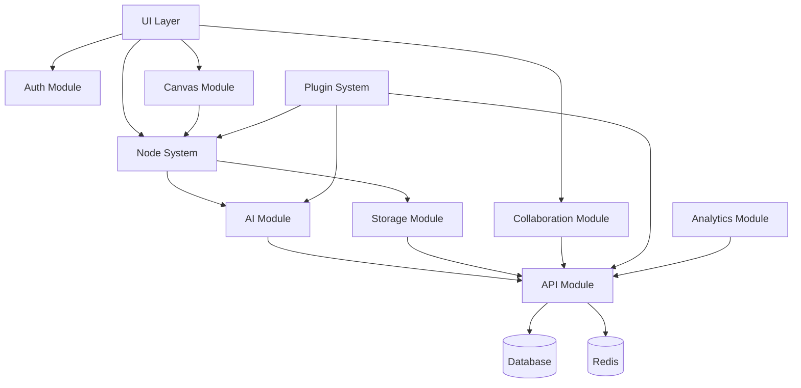

# RAGBOARD Module Specifications

## Module Dependency Graph



## Detailed Module Specifications

### 1. Authentication Module (`@ragboard/auth`)

**Interfaces**:
```typescript
interface IAuthService {
  login(credentials: LoginDTO): Promise<User>
  logout(): Promise<void>
  register(data: RegisterDTO): Promise<User>
  getCurrentUser(): Promise<User | null>
  hasPermission(resource: string, action: string): boolean
}

interface IPermissionService {
  can(user: User, action: string, resource: any): boolean
  defineAbility(user: User): Ability
  checkBoardAccess(userId: string, boardId: string): Promise<boolean>
}
```

**Dependencies**:
- `@supabase/supabase-js`
- `@casl/ability`
- `jsonwebtoken`

**Exports**:
- `AuthProvider` React component
- `useAuth` hook
- `withAuth` HOC
- `ability` CASL instance

---

### 2. Canvas Module (`@ragboard/canvas`)

**Interfaces**:
```typescript
interface ICanvasService {
  initialize(containerId: string): ExcalidrawAPI
  getElements(): ExcalidrawElement[]
  addElement(element: ExcalidrawElement): void
  updateElement(id: string, updates: Partial<ExcalidrawElement>): void
  exportAsImage(format: 'png' | 'svg'): Promise<Blob>
  exportAsJSON(): string
  importFromJSON(data: string): void
}

interface IViewportController {
  panTo(x: number, y: number): void
  zoomTo(level: number): void
  fitToContent(): void
  centerElement(elementId: string): void
}
```

**Dependencies**:
- `@excalidraw/excalidraw`
- `react`
- `@ragboard/nodes`

**Exports**:
- `Canvas` component
- `CanvasProvider`
- `useCanvas` hook
- `CanvasToolbar` component

---

### 3. Node System Module (`@ragboard/nodes`)

**Core Types**:
```typescript
interface INode<T = any> {
  id: string
  type: NodeType
  position: Position
  size: Size
  data: T
  connections: Connection[]
  metadata: NodeMetadata
}

interface INodeRenderer<T = any> {
  type: string
  component: React.FC<NodeProps<T>>
  defaultSize: Size
  resizable: boolean
  connectableTypes: string[]
  serialize(node: INode<T>): string
  deserialize(data: string): INode<T>
  validate(data: T): boolean
}

interface INodeRegistry {
  register<T>(renderer: INodeRenderer<T>): void
  get(type: string): INodeRenderer
  list(): string[]
  create<T>(type: string, data: Partial<INode<T>>): INode<T>
}
```

**Built-in Nodes**:
- `TextNode` - Rich text editor with Lexical
- `AINode` - Chat interface with model selection
- `MediaNode` - Images and videos with preview
- `DocumentNode` - PDF/DOCX viewer
- `AudioNode` - Recording and playback
- `URLNode` - Web content preview
- `FolderNode` - Group container

**Exports**:
- `NodeRegistry` singleton
- `NodeRenderer` component
- `useNode` hook
- `NodeConnection` component
- All node type components

---

### 4. AI Integration Module (`@ragboard/ai`)

**Interfaces**:
```typescript
interface IAIService {
  chat(messages: Message[], context?: Context): Promise<Response>
  complete(prompt: string, options?: CompletionOptions): Promise<string>
  embed(text: string): Promise<number[]>
  transcribe(audio: Blob): Promise<string>
}

interface IRAGService {
  indexNode(node: INode): Promise<void>
  search(query: string, limit?: number): Promise<SearchResult[]>
  getContext(nodeIds: string[]): Promise<Context>
  clearIndex(boardId: string): Promise<void>
}

interface IPromptManager {
  get(key: string): PromptTemplate
  compile(template: PromptTemplate, data: any): string
  register(key: string, template: PromptTemplate): void
}
```

**Dependencies**:
- `langchain`
- `@xenova/transformers`
- `chromadb`
- Custom `requesty-client`

**Exports**:
- `AIProvider` component
- `useAI` hook
- `RAGIndexer` class
- `PromptLibrary` singleton

---

### 5. Collaboration Module (`@ragboard/collaboration`)

**Interfaces**:
```typescript
interface ICollaborationService {
  join(boardId: string): Promise<Y.Doc>
  leave(): void
  getAwareness(): Awareness
  broadcastCursor(position: Position): void
  addComment(nodeId: string, text: string): void
}

interface IPresenceService {
  getUsers(): User[]
  updatePresence(data: PresenceData): void
  subscribeToCursors(callback: (cursors: Cursor[]) => void): () => void
}
```

**Dependencies**:
- `yjs`
- `y-partykit`
- `@partykit/react`

**Exports**:
- `CollaborationProvider`
- `useCollaboration` hook
- `Cursors` component
- `Comments` component
- `PresenceList` component

---

### 6. Storage Module (`@ragboard/storage`)

**Interfaces**:
```typescript
interface IStorageService {
  upload(file: File, options?: UploadOptions): Promise<StorageObject>
  download(key: string): Promise<Blob>
  delete(key: string): Promise<void>
  getUrl(key: string, expires?: number): string
  list(prefix: string): Promise<StorageObject[]>
}

interface IFileProcessor {
  canProcess(mimeType: string): boolean
  process(file: File): Promise<ProcessedFile>
  extractText(file: File): Promise<string>
  generateThumbnail(file: File): Promise<Blob>
}
```

**Dependencies**:
- `minio`
- `sharp`
- `pdf-parse`
- `mammoth`

**Exports**:
- `StorageProvider`
- `useStorage` hook
- `FileUploader` component
- `FileProcessorRegistry`

---

### 7. API Module (`@ragboard/api`)

**tRPC Routers**:
```typescript
// Board Router
export const boardRouter = router({
  list: protectedProcedure.query(),
  get: protectedProcedure.input(z.string()).query(),
  create: protectedProcedure.input(CreateBoardSchema).mutation(),
  update: protectedProcedure.input(UpdateBoardSchema).mutation(),
  delete: protectedProcedure.input(z.string()).mutation(),
})

// Node Router  
export const nodeRouter = router({
  create: protectedProcedure.input(CreateNodeSchema).mutation(),
  update: protectedProcedure.input(UpdateNodeSchema).mutation(),
  delete: protectedProcedure.input(z.string()).mutation(),
  connect: protectedProcedure.input(ConnectNodesSchema).mutation(),
})

// AI Router
export const aiRouter = router({
  chat: protectedProcedure.input(ChatSchema).mutation(),
  complete: protectedProcedure.input(CompleteSchema).mutation(),
  transcribe: protectedProcedure.input(TranscribeSchema).mutation(),
})
```

**GraphQL Schema** (optional):
```graphql
type Board {
  id: ID!
  name: String!
  nodes: [Node!]!
  collaborators: [User!]!
  createdAt: DateTime!
  updatedAt: DateTime!
}

type Node {
  id: ID!
  type: NodeType!
  position: Position!
  size: Size!
  data: JSON!
  connections: [Connection!]!
}
```

**Exports**:
- `appRouter` (tRPC)
- `createContext` function
- Type definitions
- Zod schemas

---

### 8. Analytics Module (`@ragboard/analytics`)

**Interfaces**:
```typescript
interface IAnalyticsService {
  track(event: string, properties?: any): void
  identify(userId: string, traits?: any): void
  page(name: string, properties?: any): void
  group(groupId: string, traits?: any): void
}

interface IMetricsCollector {
  measurePerformance(operation: string, fn: () => Promise<any>): Promise<any>
  recordMetric(name: string, value: number, tags?: Record<string, string>): void
  getMetrics(): Metrics
}
```

**Dependencies**:
- `posthog-js`
- `@opentelemetry/api`

**Exports**:
- `AnalyticsProvider`
- `useAnalytics` hook
- `trackEvent` helper
- `PerformanceMonitor` class

---

### 9. Plugin Module (`@ragboard/plugins`)

**Interfaces**:
```typescript
interface IPlugin {
  id: string
  name: string
  version: string
  author: string
  description: string
  permissions: Permission[]
  
  activate(context: PluginContext): void
  deactivate(): void
}

interface IPluginManager {
  register(plugin: IPlugin): void
  unregister(pluginId: string): void
  enable(pluginId: string): void
  disable(pluginId: string): void
  getEnabled(): IPlugin[]
}

interface PluginContext {
  nodeRegistry: INodeRegistry
  aiService: IAIService
  storageService: IStorageService
  eventBus: EventEmitter
  ui: {
    registerMenuItem(item: MenuItem): void
    registerToolbarItem(item: ToolbarItem): void
    registerNodeAction(nodeType: string, action: NodeAction): void
  }
}
```

**Security Sandbox**:
```typescript
interface IPluginSandbox {
  execute(code: string, context: SandboxContext): any
  validatePermissions(plugin: IPlugin, requested: Permission[]): boolean
  isolate(fn: Function): Function
}
```

**Exports**:
- `PluginManager` singleton
- `PluginAPI` for plugin developers
- `PluginMarketplace` component
- `usePlugin` hook

---

## Inter-Module Communication

### Event Bus Pattern
```typescript
// Central event bus for decoupled communication
export const eventBus = new EventEmitter()

// Example events
eventBus.emit('node:created', { node })
eventBus.emit('board:saved', { boardId })
eventBus.emit('ai:response', { response })
eventBus.emit('collaboration:user-joined', { user })
```

### Shared Types (`@ragboard/types`)
```typescript
// Common types used across modules
export interface Position { x: number; y: number }
export interface Size { width: number; height: number }
export interface User { id: string; email: string; name: string }
export interface Board { id: string; name: string; nodes: INode[] }
export interface Connection { from: string; to: string; type: ConnectionType }
```

### Module Loading Strategy
```typescript
// Lazy load heavy modules
const AIModule = lazy(() => import('@ragboard/ai'))
const CollaborationModule = lazy(() => import('@ragboard/collaboration'))

// Core modules loaded upfront
import { Canvas } from '@ragboard/canvas'
import { NodeRegistry } from '@ragboard/nodes'
```

---

## Module Development Guidelines

1. **Independence**: Each module should be independently testable
2. **Type Safety**: Full TypeScript coverage with strict mode
3. **Documentation**: JSDoc comments for all public APIs
4. **Testing**: Minimum 80% coverage per module
5. **Versioning**: Semantic versioning for all packages
6. **Error Handling**: Graceful degradation when modules fail
7. **Performance**: Lazy loading and code splitting where appropriate
8. **Security**: Input validation and sanitization at module boundaries

---

## Module Registry

```json
{
  "@ragboard/auth": "1.0.0",
  "@ragboard/canvas": "1.0.0", 
  "@ragboard/nodes": "1.0.0",
  "@ragboard/ai": "1.0.0",
  "@ragboard/collaboration": "1.0.0",
  "@ragboard/storage": "1.0.0",
  "@ragboard/api": "1.0.0",
  "@ragboard/analytics": "1.0.0",
  "@ragboard/plugins": "1.0.0",
  "@ragboard/types": "1.0.0",
  "@ragboard/ui": "1.0.0"
}
```