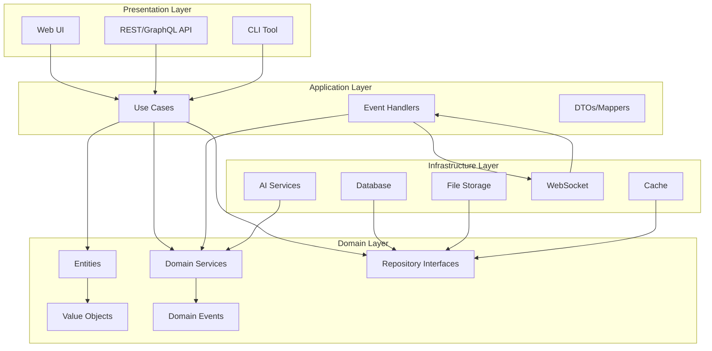

# RAGBOARD Clean Modular Architecture Design

## Executive Summary

This document presents a clean, modular architecture for RAGBOARD based on hexagonal/clean architecture principles. The design ensures clear separation of concerns, high maintainability, and enables independent development and testing of each module.

## Architecture Overview

```
┌─────────────────────────────────────────────────────────────────────────┐
│                           Presentation Layer                             │
│  ┌─────────────┐  ┌──────────────┐  ┌────────────┐  ┌───────────────┐ │
│  │   Web UI    │  │  Mobile UI   │  │  CLI Tool  │  │  Public API   │ │
│  │  (React)    │  │ (React Native)│  │            │  │   (REST)      │ │
│  └──────┬──────┘  └──────┬───────┘  └─────┬──────┘  └───────┬───────┘ │
└─────────┼────────────────┼────────────────┼──────────────────┼─────────┘
          │                │                │                  │
┌─────────▼────────────────▼────────────────▼──────────────────▼─────────┐
│                         Application Layer                                │
│  ┌─────────────────────────────────────────────────────────────────┐   │
│  │                    Use Case Orchestrators                        │   │
│  │  ┌────────────┐  ┌────────────┐  ┌────────────┐  ┌──────────┐ │   │
│  │  │Board Mgmt  │  │Node Mgmt   │  │AI Chat     │  │Collab    │ │   │
│  │  │Use Cases   │  │Use Cases   │  │Use Cases   │  │Use Cases │ │   │
│  │  └────────────┘  └────────────┘  └────────────┘  └──────────┘ │   │
│  └─────────────────────────────────────────────────────────────────┘   │
└─────────────────────────────────────────────────────────────────────────┘
                                    │
┌───────────────────────────────────▼─────────────────────────────────────┐
│                           Domain Layer                                   │
│  ┌─────────────────────────────────────────────────────────────────┐   │
│  │                      Core Business Logic                         │   │
│  │  ┌────────────┐  ┌────────────┐  ┌────────────┐  ┌──────────┐ │   │
│  │  │   Board    │  │    Node    │  │ Connection │  │   Chat   │ │   │
│  │  │  Entities  │  │  Entities  │  │  Entities  │  │ Entities │ │   │
│  │  └────────────┘  └────────────┘  └────────────┘  └──────────┘ │   │
│  │  ┌────────────┐  ┌────────────┐  ┌────────────┐  ┌──────────┐ │   │
│  │  │   Board    │  │    Node    │  │    AI      │  │  Media   │ │   │
│  │  │  Services  │  │  Services  │  │  Services  │  │ Services │ │   │
│  │  └────────────┘  └────────────┘  └────────────┘  └──────────┘ │   │
│  └─────────────────────────────────────────────────────────────────┘   │
└─────────────────────────────────────────────────────────────────────────┘
                                    │
┌───────────────────────────────────▼─────────────────────────────────────┐
│                      Infrastructure Layer                                │
│  ┌─────────────┐  ┌──────────────┐  ┌────────────┐  ┌───────────────┐ │
│  │  PostgreSQL │  │  Vector DB   │  │   Redis    │  │  S3 Storage   │ │
│  │  Repository │  │  Repository  │  │   Cache    │  │  Repository   │ │
│  └─────────────┘  └──────────────┘  └────────────┘  └───────────────┘ │
│  ┌─────────────┐  ┌──────────────┐  ┌────────────┐  ┌───────────────┐ │
│  │   Claude    │  │    GPT-4     │  │  Whisper   │  │   WebSocket   │ │
│  │   Adapter   │  │   Adapter    │  │  Adapter   │  │    Server     │ │
│  └─────────────┘  └──────────────┘  └────────────┘  └───────────────┘ │
└─────────────────────────────────────────────────────────────────────────┘
```

## Core Architecture Principles

### 1. Dependency Rule
- Dependencies only point inward
- Domain layer has no external dependencies
- Infrastructure depends on domain, not vice versa
- Application orchestrates between layers

### 2. Separation of Concerns
- Each module has a single, well-defined responsibility
- Business logic is isolated from technical details
- UI logic is separated from business logic
- External services are abstracted behind interfaces

### 3. Testability
- Core business logic can be tested without external dependencies
- Each layer can be tested in isolation
- Mock implementations for all external services
- Integration tests at module boundaries

### 4. Flexibility
- Easy to swap implementations (e.g., different databases)
- Support for multiple UIs without changing core logic
- Plugin architecture for extensibility
- Feature toggles for gradual rollout

## Module Architecture

### 1. Authentication Module

```typescript
// Domain Layer
namespace Domain.Auth {
  // Entities
  interface User {
    id: UserId
    email: Email
    profile: UserProfile
    permissions: Set<Permission>
    createdAt: DateTime
  }

  interface Session {
    id: SessionId
    userId: UserId
    token: AuthToken
    expiresAt: DateTime
    refreshToken?: RefreshToken
  }

  // Value Objects
  class Email {
    constructor(private value: string) {
      if (!Email.isValid(value)) throw new InvalidEmailError()
    }
    static isValid(value: string): boolean { /* validation */ }
  }

  // Domain Services
  interface AuthenticationService {
    authenticate(email: Email, password: Password): Promise<User>
    createSession(user: User): Promise<Session>
    validateSession(token: AuthToken): Promise<User>
    refreshSession(refreshToken: RefreshToken): Promise<Session>
  }

  // Repository Interfaces
  interface UserRepository {
    findByEmail(email: Email): Promise<User | null>
    findById(id: UserId): Promise<User | null>
    save(user: User): Promise<User>
  }

  interface SessionRepository {
    save(session: Session): Promise<Session>
    findByToken(token: AuthToken): Promise<Session | null>
    invalidate(sessionId: SessionId): Promise<void>
  }
}

// Application Layer
namespace Application.Auth {
  // Use Cases
  class LoginUseCase {
    constructor(
      private authService: Domain.Auth.AuthenticationService,
      private sessionRepo: Domain.Auth.SessionRepository,
      private eventBus: EventBus
    ) {}

    async execute(request: LoginRequest): Promise<LoginResponse> {
      const email = new Domain.Auth.Email(request.email)
      const password = new Domain.Auth.Password(request.password)
      
      const user = await this.authService.authenticate(email, password)
      const session = await this.authService.createSession(user)
      
      await this.sessionRepo.save(session)
      await this.eventBus.publish(new UserLoggedInEvent(user.id))
      
      return { token: session.token.value, user: this.mapUserToDTO(user) }
    }
  }

  // DTOs
  interface LoginRequest {
    email: string
    password: string
    remember?: boolean
  }

  interface LoginResponse {
    token: string
    user: UserDTO
  }
}

// Infrastructure Layer
namespace Infrastructure.Auth {
  // Implementations
  class SupabaseAuthService implements Domain.Auth.AuthenticationService {
    constructor(private supabase: SupabaseClient) {}
    
    async authenticate(email: Email, password: Password): Promise<User> {
      const { data, error } = await this.supabase.auth.signInWithPassword({
        email: email.value,
        password: password.value
      })
      if (error) throw new AuthenticationError(error.message)
      return this.mapSupabaseUserToDomain(data.user)
    }
  }

  class PostgresUserRepository implements Domain.Auth.UserRepository {
    constructor(private db: DatabaseConnection) {}
    
    async findByEmail(email: Email): Promise<User | null> {
      const result = await this.db.query(
        'SELECT * FROM users WHERE email = $1',
        [email.value]
      )
      return result.rows[0] ? this.mapToEntity(result.rows[0]) : null
    }
  }
}
```

### 2. Canvas/Board Module

```typescript
// Domain Layer
namespace Domain.Board {
  // Entities
  interface Board {
    id: BoardId
    ownerId: UserId
    name: string
    description?: string
    viewport: Viewport
    settings: BoardSettings
    createdAt: DateTime
    updatedAt: DateTime
  }

  // Value Objects
  class Viewport {
    constructor(
      public readonly x: number,
      public readonly y: number,
      public readonly zoom: number
    ) {
      if (zoom < 0.1 || zoom > 10) throw new InvalidZoomError()
    }
    
    pan(deltaX: number, deltaY: number): Viewport {
      return new Viewport(this.x + deltaX, this.y + deltaY, this.zoom)
    }
    
    zoomTo(level: number): Viewport {
      return new Viewport(this.x, this.y, level)
    }
  }

  // Domain Services
  interface BoardService {
    create(name: string, ownerId: UserId): Promise<Board>
    updateViewport(boardId: BoardId, viewport: Viewport): Promise<void>
    share(boardId: BoardId, permissions: SharePermissions): Promise<ShareLink>
  }

  // Repository Interface
  interface BoardRepository {
    findById(id: BoardId): Promise<Board | null>
    findByOwner(ownerId: UserId): Promise<Board[]>
    save(board: Board): Promise<Board>
    delete(id: BoardId): Promise<void>
  }
}

// Application Layer
namespace Application.Board {
  // Use Cases
  class CreateBoardUseCase {
    constructor(
      private boardService: Domain.Board.BoardService,
      private boardRepo: Domain.Board.BoardRepository,
      private authContext: AuthContext
    ) {}

    async execute(request: CreateBoardRequest): Promise<BoardDTO> {
      const user = await this.authContext.getCurrentUser()
      if (!user) throw new UnauthorizedError()
      
      const board = await this.boardService.create(request.name, user.id)
      await this.boardRepo.save(board)
      
      return this.mapToDTO(board)
    }
  }

  // Real-time Collaboration Handler
  class BoardCollaborationHandler {
    constructor(
      private boardRepo: Domain.Board.BoardRepository,
      private websocket: WebSocketServer,
      private presenceTracker: PresenceTracker
    ) {}

    async handleViewportChange(data: ViewportChangeEvent) {
      const board = await this.boardRepo.findById(data.boardId)
      if (!board) return
      
      // Update presence
      await this.presenceTracker.updateUserViewport(
        data.userId,
        data.boardId,
        data.viewport
      )
      
      // Broadcast to other users
      this.websocket.broadcast(`board:${data.boardId}`, {
        type: 'viewport-changed',
        userId: data.userId,
        viewport: data.viewport
      })
    }
  }
}
```

### 3. Card Types System

```typescript
// Domain Layer
namespace Domain.Node {
  // Base Node Entity
  abstract class Node {
    constructor(
      public readonly id: NodeId,
      public readonly boardId: BoardId,
      public position: Position,
      public size: Size,
      public readonly createdAt: DateTime,
      public updatedAt: DateTime
    ) {}
    
    abstract get type(): NodeType
    abstract validate(): void
    
    moveTo(position: Position): void {
      this.position = position
      this.updatedAt = DateTime.now()
    }
    
    resize(size: Size): void {
      this.size = size
      this.updatedAt = DateTime.now()
    }
  }

  // Specific Node Types
  class ResourceNode extends Node {
    constructor(
      id: NodeId,
      boardId: BoardId,
      position: Position,
      size: Size,
      public resourceType: ResourceType,
      public title: string,
      public content: ResourceContent,
      public metadata: ResourceMetadata,
      createdAt: DateTime,
      updatedAt: DateTime
    ) {
      super(id, boardId, position, size, createdAt, updatedAt)
    }
    
    get type(): NodeType { return NodeType.Resource }
    
    validate(): void {
      if (!this.title) throw new InvalidNodeError('Title is required')
      if (!this.content.validate()) throw new InvalidNodeError('Invalid content')
    }
  }

  class AIChatNode extends Node {
    constructor(
      id: NodeId,
      boardId: BoardId,
      position: Position,
      size: Size,
      public model: AIModel,
      public systemPrompt: string,
      public temperature: number,
      public maxTokens: number,
      createdAt: DateTime,
      updatedAt: DateTime
    ) {
      super(id, boardId, position, size, createdAt, updatedAt)
    }
    
    get type(): NodeType { return NodeType.AIChat }
    
    validate(): void {
      if (this.temperature < 0 || this.temperature > 2) {
        throw new InvalidNodeError('Temperature must be between 0 and 2')
      }
    }
  }

  // Node Factory
  class NodeFactory {
    static create(type: NodeType, data: CreateNodeData): Node {
      switch (type) {
        case NodeType.Resource:
          return new ResourceNode(/* ... */)
        case NodeType.AIChat:
          return new AIChatNode(/* ... */)
        case NodeType.Folder:
          return new FolderNode(/* ... */)
        default:
          throw new UnsupportedNodeTypeError(type)
      }
    }
  }

  // Repository Interface
  interface NodeRepository {
    findById(id: NodeId): Promise<Node | null>
    findByBoard(boardId: BoardId): Promise<Node[]>
    save(node: Node): Promise<Node>
    delete(id: NodeId): Promise<void>
  }
}

// Plugin System for Custom Node Types
namespace Domain.Node.Plugin {
  interface NodeTypePlugin {
    type: string
    component: ComponentType
    validator: NodeValidator
    serializer: NodeSerializer
    deserializer: NodeDeserializer
  }

  class NodeTypeRegistry {
    private plugins = new Map<string, NodeTypePlugin>()
    
    register(plugin: NodeTypePlugin): void {
      if (this.plugins.has(plugin.type)) {
        throw new DuplicateNodeTypeError(plugin.type)
      }
      this.plugins.set(plugin.type, plugin)
    }
    
    getPlugin(type: string): NodeTypePlugin | null {
      return this.plugins.get(type) || null
    }
  }
}
```

### 4. AI Integration Module

```typescript
// Domain Layer
namespace Domain.AI {
  // Entities
  interface ChatSession {
    id: ChatSessionId
    nodeId: NodeId
    userId: UserId
    model: AIModel
    context: RAGContext
    messages: Message[]
    startedAt: DateTime
    endedAt?: DateTime
  }

  interface RAGContext {
    connectedResources: ResourceReference[]
    embeddings: Embedding[]
    systemPrompt: string
    maxTokens: number
    temperature: number
  }

  // Value Objects
  class Message {
    constructor(
      public readonly role: MessageRole,
      public readonly content: string,
      public readonly timestamp: DateTime,
      public readonly metadata?: MessageMetadata
    ) {}
  }

  // Domain Services
  interface AIService {
    createSession(nodeId: NodeId, userId: UserId): Promise<ChatSession>
    sendMessage(sessionId: ChatSessionId, content: string): Promise<Message>
    buildContext(nodeId: NodeId): Promise<RAGContext>
    generateEmbedding(text: string): Promise<Embedding>
  }

  interface VectorSearchService {
    search(query: Embedding, options: SearchOptions): Promise<SearchResult[]>
    index(resource: Resource): Promise<void>
    delete(resourceId: ResourceId): Promise<void>
  }
}

// Application Layer
namespace Application.AI {
  // Use Cases
  class SendChatMessageUseCase {
    constructor(
      private aiService: Domain.AI.AIService,
      private sessionRepo: Domain.AI.ChatSessionRepository,
      private eventBus: EventBus
    ) {}

    async execute(request: SendMessageRequest): Promise<MessageDTO> {
      const session = await this.sessionRepo.findById(request.sessionId)
      if (!session) throw new SessionNotFoundError()
      
      // Build context from connected resources
      const context = await this.aiService.buildContext(session.nodeId)
      
      // Send message with context
      const response = await this.aiService.sendMessage(
        session.id,
        request.message
      )
      
      // Update session
      session.addMessage(response)
      await this.sessionRepo.save(session)
      
      // Emit event for real-time updates
      await this.eventBus.publish(new MessageSentEvent(session.id, response))
      
      return this.mapToDTO(response)
    }
  }

  // Context Building Strategy
  class SmartContextBuilder {
    constructor(
      private nodeRepo: Domain.Node.NodeRepository,
      private connectionRepo: Domain.Connection.ConnectionRepository,
      private vectorSearch: Domain.AI.VectorSearchService,
      private embeddingService: Domain.AI.AIService
    ) {}

    async buildContext(chatNodeId: NodeId): Promise<RAGContext> {
      // 1. Get directly connected resources
      const connections = await this.connectionRepo.findByNode(chatNodeId)
      const connectedNodes = await Promise.all(
        connections.map(c => this.nodeRepo.findById(c.targetId))
      )
      
      // 2. Extract text content from resources
      const textContent = connectedNodes
        .filter(n => n instanceof ResourceNode)
        .map(n => n.extractText())
        .join('\n\n')
      
      // 3. Generate query embedding
      const queryEmbedding = await this.embeddingService.generateEmbedding(
        textContent.substring(0, 1000) // First 1000 chars as query
      )
      
      // 4. Find similar content via vector search
      const similarContent = await this.vectorSearch.search(queryEmbedding, {
        limit: 10,
        threshold: 0.7
      })
      
      // 5. Build structured context
      return {
        connectedResources: connectedNodes.map(n => ({
          id: n.id,
          type: n.type,
          title: n.title,
          summary: n.getSummary()
        })),
        embeddings: similarContent.map(s => s.embedding),
        systemPrompt: this.buildSystemPrompt(connectedNodes, similarContent),
        maxTokens: 4000,
        temperature: 0.7
      }
    }
  }
}

// Infrastructure Layer
namespace Infrastructure.AI {
  // Multi-provider AI implementation
  class MultiProviderAIService implements Domain.AI.AIService {
    private providers: Map<AIModel, AIProvider>
    
    constructor() {
      this.providers = new Map([
        [AIModel.Claude3, new ClaudeProvider()],
        [AIModel.GPT4, new OpenAIProvider()],
        [AIModel.Gemini, new GeminiProvider()]
      ])
    }
    
    async sendMessage(sessionId: ChatSessionId, content: string): Promise<Message> {
      const session = await this.getSession(sessionId)
      const provider = this.providers.get(session.model)
      
      if (!provider) throw new UnsupportedModelError(session.model)
      
      const response = await provider.complete({
        messages: [...session.messages, { role: 'user', content }],
        systemPrompt: session.context.systemPrompt,
        maxTokens: session.context.maxTokens,
        temperature: session.context.temperature
      })
      
      return new Message(MessageRole.Assistant, response, DateTime.now())
    }
  }

  // Vector database implementation
  class ChromaVectorSearch implements Domain.AI.VectorSearchService {
    constructor(private chroma: ChromaClient) {}
    
    async search(query: Embedding, options: SearchOptions): Promise<SearchResult[]> {
      const results = await this.chroma.query({
        queryEmbeddings: [query.values],
        nResults: options.limit,
        where: options.filter
      })
      
      return results.map(r => ({
        id: r.id,
        score: r.distance,
        embedding: new Embedding(r.embedding),
        metadata: r.metadata
      }))
    }
  }
}
```

### 5. Real-time Collaboration Module

```typescript
// Domain Layer
namespace Domain.Collaboration {
  // Entities
  interface CollaborationSession {
    id: SessionId
    boardId: BoardId
    participants: Set<Participant>
    startedAt: DateTime
  }

  interface Participant {
    userId: UserId
    cursor?: CursorPosition
    selection?: Selection
    presence: PresenceStatus
    joinedAt: DateTime
    lastActiveAt: DateTime
  }

  // Value Objects
  class CursorPosition {
    constructor(
      public readonly x: number,
      public readonly y: number,
      public readonly viewportX: number,
      public readonly viewportY: number
    ) {}
  }

  // Domain Events
  abstract class CollaborationEvent {
    constructor(
      public readonly sessionId: SessionId,
      public readonly userId: UserId,
      public readonly timestamp: DateTime
    ) {}
  }

  class CursorMovedEvent extends CollaborationEvent {
    constructor(
      sessionId: SessionId,
      userId: UserId,
      public readonly position: CursorPosition,
      timestamp: DateTime
    ) {
      super(sessionId, userId, timestamp)
    }
  }

  // Domain Services
  interface CollaborationService {
    joinSession(boardId: BoardId, userId: UserId): Promise<CollaborationSession>
    updateCursor(sessionId: SessionId, userId: UserId, position: CursorPosition): Promise<void>
    updateSelection(sessionId: SessionId, userId: UserId, selection: Selection): Promise<void>
    getActiveParticipants(boardId: BoardId): Promise<Participant[]>
  }
}

// Application Layer
namespace Application.Collaboration {
  // Real-time Event Handlers
  class CollaborationEventHandler {
    constructor(
      private collaborationService: Domain.Collaboration.CollaborationService,
      private websocket: WebSocketServer,
      private yjs: YjsServer
    ) {}

    async handleCursorMove(event: CursorMoveEvent) {
      // Update domain state
      await this.collaborationService.updateCursor(
        event.sessionId,
        event.userId,
        event.position
      )
      
      // Broadcast to other participants
      this.websocket.broadcast(`board:${event.boardId}`, {
        type: 'cursor-moved',
        userId: event.userId,
        position: event.position
      })
    }

    async handleNodeEdit(event: NodeEditEvent) {
      // Apply to Y.js document for CRDT
      const ydoc = await this.yjs.getDocument(event.boardId)
      const ymap = ydoc.getMap('nodes')
      
      ydoc.transact(() => {
        const node = ymap.get(event.nodeId)
        if (node) {
          Object.assign(node, event.changes)
        }
      })
      
      // Broadcast changes
      this.websocket.broadcast(`board:${event.boardId}`, {
        type: 'node-edited',
        nodeId: event.nodeId,
        changes: event.changes,
        userId: event.userId
      })
    }
  }

  // Conflict Resolution
  class ConflictResolver {
    resolve(localChange: Change, remoteChange: Change): Resolution {
      // Last-write-wins with vector clocks
      if (localChange.vectorClock.happensBefore(remoteChange.vectorClock)) {
        return { accepted: remoteChange, rejected: localChange }
      }
      return { accepted: localChange, rejected: remoteChange }
    }
  }
}

// Infrastructure Layer
namespace Infrastructure.Collaboration {
  // WebSocket implementation
  class SocketIOCollaborationServer implements CollaborationServer {
    private io: Server
    private sessions = new Map<string, CollaborationSession>()
    
    constructor(httpServer: HttpServer) {
      this.io = new Server(httpServer, {
        cors: { origin: process.env.CLIENT_URL }
      })
      
      this.setupHandlers()
    }
    
    private setupHandlers() {
      this.io.on('connection', (socket) => {
        socket.on('join-board', async (data) => {
          const session = await this.joinBoard(socket, data)
          socket.join(`board:${data.boardId}`)
          
          // Send current participants
          socket.emit('participants', {
            participants: Array.from(session.participants)
          })
          
          // Notify others
          socket.to(`board:${data.boardId}`).emit('user-joined', {
            userId: data.userId,
            timestamp: Date.now()
          })
        })
        
        socket.on('cursor-move', (data) => {
          socket.to(`board:${data.boardId}`).emit('cursor-moved', {
            userId: socket.data.userId,
            position: data.position
          })
        })
      })
    }
  }

  // Y.js integration for CRDT
  class YjsCollaborationProvider {
    private docs = new Map<string, Y.Doc>()
    
    async getDocument(boardId: string): Promise<Y.Doc> {
      if (!this.docs.has(boardId)) {
        const doc = new Y.Doc()
        await this.loadFromPersistence(doc, boardId)
        this.docs.set(boardId, doc)
        
        // Setup persistence
        doc.on('update', (update) => {
          this.persistUpdate(boardId, update)
        })
      }
      
      return this.docs.get(boardId)!
    }
  }
}
```

### 6. Storage Abstraction Module

```typescript
// Domain Layer
namespace Domain.Storage {
  // Interfaces
  interface FileStorage {
    upload(file: File, path: string): Promise<FileReference>
    download(reference: FileReference): Promise<File>
    delete(reference: FileReference): Promise<void>
    generatePresignedUrl(reference: FileReference, expiresIn: number): Promise<string>
  }

  interface MediaProcessor {
    canProcess(mimeType: string): boolean
    process(file: File): Promise<ProcessedMedia>
    generateThumbnail(media: ProcessedMedia): Promise<Thumbnail>
    extractMetadata(file: File): Promise<MediaMetadata>
  }

  // Value Objects
  class FileReference {
    constructor(
      public readonly bucket: string,
      public readonly key: string,
      public readonly url: string,
      public readonly size: number,
      public readonly mimeType: string
    ) {}
  }

  class ProcessedMedia {
    constructor(
      public readonly original: FileReference,
      public readonly processed: FileReference,
      public readonly thumbnail?: Thumbnail,
      public readonly metadata?: MediaMetadata,
      public readonly extractedText?: string
    ) {}
  }
}

// Application Layer
namespace Application.Storage {
  // Use Cases
  class UploadResourceUseCase {
    constructor(
      private storage: Domain.Storage.FileStorage,
      private processors: Domain.Storage.MediaProcessor[],
      private nodeService: Domain.Node.NodeService,
      private eventBus: EventBus
    ) {}

    async execute(request: UploadRequest): Promise<ResourceNodeDTO> {
      // 1. Find appropriate processor
      const processor = this.processors.find(p => 
        p.canProcess(request.file.mimeType)
      )
      
      if (!processor) throw new UnsupportedFileTypeError()
      
      // 2. Process the file
      const processed = await processor.process(request.file)
      
      // 3. Upload to storage
      const reference = await this.storage.upload(
        processed.processed.file,
        `boards/${request.boardId}/resources/${request.file.name}`
      )
      
      // 4. Create resource node
      const node = await this.nodeService.createResourceNode({
        boardId: request.boardId,
        resourceType: this.determineResourceType(request.file.mimeType),
        title: request.title || request.file.name,
        content: {
          fileReference: reference,
          thumbnail: processed.thumbnail,
          extractedText: processed.extractedText,
          metadata: processed.metadata
        }
      })
      
      // 5. Emit event
      await this.eventBus.publish(new ResourceUploadedEvent(node.id, reference))
      
      return this.mapToDTO(node)
    }
  }
}

// Infrastructure Layer
namespace Infrastructure.Storage {
  // S3 implementation
  class S3FileStorage implements Domain.Storage.FileStorage {
    constructor(private s3: S3Client) {}
    
    async upload(file: File, path: string): Promise<FileReference> {
      const command = new PutObjectCommand({
        Bucket: process.env.S3_BUCKET,
        Key: path,
        Body: file.stream(),
        ContentType: file.mimeType,
        Metadata: {
          originalName: file.name,
          uploadedAt: new Date().toISOString()
        }
      })
      
      await this.s3.send(command)
      
      return new FileReference(
        process.env.S3_BUCKET,
        path,
        `https://${process.env.S3_BUCKET}.s3.amazonaws.com/${path}`,
        file.size,
        file.mimeType
      )
    }
  }

  // Media processors
  class ImageProcessor implements Domain.Storage.MediaProcessor {
    canProcess(mimeType: string): boolean {
      return mimeType.startsWith('image/')
    }
    
    async process(file: File): Promise<ProcessedMedia> {
      const buffer = await file.arrayBuffer()
      
      // Generate thumbnail
      const thumbnail = await sharp(buffer)
        .resize(300, 300, { fit: 'cover' })
        .toBuffer()
      
      // Extract text via OCR
      const text = await this.performOCR(buffer)
      
      // Extract metadata
      const metadata = await sharp(buffer).metadata()
      
      return new ProcessedMedia(
        file,
        file, // For images, processed is same as original
        new Thumbnail(thumbnail, 'image/jpeg'),
        {
          width: metadata.width,
          height: metadata.height,
          format: metadata.format
        },
        text
      )
    }
  }
}
```

### 7. API Layer Module

```typescript
// Presentation Layer
namespace Presentation.API {
  // REST API Controllers
  class BoardController {
    constructor(
      private createBoardUseCase: Application.Board.CreateBoardUseCase,
      private getBoardUseCase: Application.Board.GetBoardUseCase,
      private updateBoardUseCase: Application.Board.UpdateBoardUseCase
    ) {}

    @Post('/boards')
    @Authenticated()
    async createBoard(req: Request, res: Response) {
      try {
        const result = await this.createBoardUseCase.execute({
          name: req.body.name,
          description: req.body.description
        })
        
        res.status(201).json({
          success: true,
          data: result
        })
      } catch (error) {
        this.handleError(error, res)
      }
    }

    @Get('/boards/:id')
    @Authenticated()
    @RequirePermission('board.view')
    async getBoard(req: Request, res: Response) {
      const result = await this.getBoardUseCase.execute({
        boardId: req.params.id,
        userId: req.user.id
      })
      
      res.json({
        success: true,
        data: result
      })
    }
  }

  // GraphQL Schema
  const typeDefs = gql`
    type Board {
      id: ID!
      name: String!
      description: String
      owner: User!
      nodes: [Node!]!
      connections: [Connection!]!
      createdAt: DateTime!
      updatedAt: DateTime!
    }

    interface Node {
      id: ID!
      type: NodeType!
      position: Position!
      size: Size!
    }

    type ResourceNode implements Node {
      id: ID!
      type: NodeType!
      position: Position!
      size: Size!
      resourceType: ResourceType!
      title: String!
      content: ResourceContent!
    }

    type Query {
      board(id: ID!): Board
      boards: [Board!]!
      searchNodes(query: String!, boardId: ID!): [Node!]!
    }

    type Mutation {
      createBoard(input: CreateBoardInput!): Board!
      addNode(boardId: ID!, input: AddNodeInput!): Node!
      connectNodes(from: ID!, to: ID!): Connection!
    }

    type Subscription {
      boardUpdated(boardId: ID!): BoardUpdate!
      cursorMoved(boardId: ID!): CursorUpdate!
    }
  `

  // GraphQL Resolvers
  const resolvers = {
    Query: {
      board: (_, { id }, context) => {
        return context.useCases.getBoard.execute({ boardId: id })
      },
      boards: (_, __, context) => {
        return context.useCases.listBoards.execute({ userId: context.user.id })
      }
    },
    
    Mutation: {
      createBoard: (_, { input }, context) => {
        return context.useCases.createBoard.execute(input)
      },
      addNode: (_, { boardId, input }, context) => {
        return context.useCases.addNode.execute({ boardId, ...input })
      }
    },
    
    Subscription: {
      boardUpdated: {
        subscribe: (_, { boardId }, context) => {
          return context.pubsub.asyncIterator([`board.${boardId}.updated`])
        }
      }
    }
  }
}
```

## Module Dependency Graph



## Plugin Architecture

### Plugin Interface

```typescript
namespace Plugin {
  interface RagboardPlugin {
    id: string
    name: string
    version: string
    description: string
    author: string
    
    // Lifecycle hooks
    onInstall(context: PluginContext): Promise<void>
    onActivate(context: PluginContext): Promise<void>
    onDeactivate(): Promise<void>
    onUninstall(): Promise<void>
    
    // Extension points
    nodeTypes?: NodeTypeDefinition[]
    commands?: CommandDefinition[]
    toolbar?: ToolbarItemDefinition[]
    shortcuts?: KeyboardShortcutDefinition[]
    themes?: ThemeDefinition[]
  }

  interface PluginContext {
    // Core services
    nodeService: Domain.Node.NodeService
    boardService: Domain.Board.BoardService
    aiService: Domain.AI.AIService
    
    // UI integration
    registerComponent(name: string, component: ComponentType): void
    registerRoute(path: string, component: ComponentType): void
    
    // Event system
    on(event: string, handler: EventHandler): void
    emit(event: string, data: any): void
    
    // Storage
    storage: PluginStorage
    
    // Configuration
    config: PluginConfig
  }

  // Example Plugin
  class CodeEditorPlugin implements RagboardPlugin {
    id = 'code-editor'
    name = 'Code Editor Node'
    version = '1.0.0'
    description = 'Adds a code editor node type with syntax highlighting'
    author = 'RAGBOARD Team'
    
    nodeTypes = [{
      type: 'code-editor',
      component: CodeEditorNode,
      icon: 'code',
      defaultSize: { width: 600, height: 400 },
      ports: {
        inputs: ['source'],
        outputs: ['compiled', 'ast']
      }
    }]
    
    shortcuts = [{
      key: 'cmd+shift+c',
      description: 'Create code editor node',
      handler: (context) => {
        context.nodeService.createNode({
          type: 'code-editor',
          position: context.ui.getCursorPosition()
        })
      }
    }]
    
    async onActivate(context: PluginContext) {
      // Register language servers
      context.on('code-editor.created', async (node) => {
        await this.initializeLanguageServer(node)
      })
    }
  }
}
```

## Performance Optimization Strategies

### 1. Frontend Optimizations

```typescript
// Virtualization for large boards
const VirtualizedCanvas = () => {
  const viewport = useViewport()
  const nodes = useNodes()
  
  // Only render nodes in viewport
  const visibleNodes = useMemo(() => {
    return nodes.filter(node => isInViewport(node, viewport))
  }, [nodes, viewport])
  
  return <Canvas nodes={visibleNodes} />
}

// Web Worker for heavy computations
const aiWorker = new Worker('ai-processor.worker.js')
aiWorker.postMessage({ type: 'process-context', data: resources })
aiWorker.onmessage = (e) => {
  if (e.data.type === 'context-ready') {
    updateContext(e.data.context)
  }
}
```

### 2. Backend Optimizations

```typescript
// Query optimization with DataLoader
class NodeLoader extends DataLoader<string, Node> {
  async batchLoad(ids: string[]): Promise<Node[]> {
    const nodes = await this.nodeRepo.findByIds(ids)
    return ids.map(id => nodes.find(n => n.id === id))
  }
}

// Caching strategy
class CachedBoardService {
  constructor(
    private boardService: BoardService,
    private cache: RedisCache
  ) {}
  
  async getBoard(id: string): Promise<Board> {
    const cached = await this.cache.get(`board:${id}`)
    if (cached) return cached
    
    const board = await this.boardService.getBoard(id)
    await this.cache.set(`board:${id}`, board, { ttl: 300 })
    
    return board
  }
}
```

## Security Implementation

### 1. Authentication & Authorization

```typescript
// Permission-based access control
class PermissionGuard {
  async canAccess(user: User, resource: Resource, action: Action): boolean {
    // Owner has all permissions
    if (resource.ownerId === user.id) return true
    
    // Check explicit permissions
    const permission = await this.permissionRepo.find({
      userId: user.id,
      resourceId: resource.id,
      action
    })
    
    return permission !== null
  }
}

// Row-level security
class SecureBoardRepository implements BoardRepository {
  constructor(
    private repo: BoardRepository,
    private authContext: AuthContext
  ) {}
  
  async findById(id: string): Promise<Board | null> {
    const board = await this.repo.findById(id)
    if (!board) return null
    
    const user = await this.authContext.getCurrentUser()
    const canView = await this.canUserViewBoard(user, board)
    
    return canView ? board : null
  }
}
```

### 2. Input Validation

```typescript
// Zod schemas for validation
const CreateNodeSchema = z.object({
  type: z.enum(['resource', 'chat', 'folder']),
  position: z.object({
    x: z.number().min(0),
    y: z.number().min(0)
  }),
  data: z.unknown()
})

// Sanitization
class InputSanitizer {
  sanitizeHTML(input: string): string {
    return DOMPurify.sanitize(input, {
      ALLOWED_TAGS: ['b', 'i', 'em', 'strong', 'a', 'p'],
      ALLOWED_ATTR: ['href']
    })
  }
}
```

## Testing Strategy

### 1. Unit Tests

```typescript
describe('BoardService', () => {
  let boardService: BoardService
  let boardRepo: MockBoardRepository
  
  beforeEach(() => {
    boardRepo = new MockBoardRepository()
    boardService = new BoardService(boardRepo)
  })
  
  describe('createBoard', () => {
    it('should create a board with valid data', async () => {
      const board = await boardService.create('Test Board', 'user-123')
      
      expect(board.name).toBe('Test Board')
      expect(board.ownerId).toBe('user-123')
      expect(boardRepo.save).toHaveBeenCalledWith(board)
    })
    
    it('should throw error for invalid name', async () => {
      await expect(boardService.create('', 'user-123'))
        .rejects.toThrow(InvalidBoardNameError)
    })
  })
})
```

### 2. Integration Tests

```typescript
describe('Board API Integration', () => {
  let app: Application
  let authToken: string
  
  beforeAll(async () => {
    app = await createTestApp()
    authToken = await getTestAuthToken()
  })
  
  describe('POST /boards', () => {
    it('should create a board', async () => {
      const response = await request(app)
        .post('/boards')
        .set('Authorization', `Bearer ${authToken}`)
        .send({ name: 'Test Board' })
      
      expect(response.status).toBe(201)
      expect(response.body.data).toMatchObject({
        name: 'Test Board',
        id: expect.any(String)
      })
    })
  })
})
```

## Deployment Configuration

### Docker Setup

```dockerfile
# Frontend Dockerfile
FROM node:18-alpine AS builder
WORKDIR /app
COPY package*.json ./
RUN npm ci
COPY . .
RUN npm run build

FROM nginx:alpine
COPY --from=builder /app/dist /usr/share/nginx/html
COPY nginx.conf /etc/nginx/nginx.conf

# Backend Dockerfile
FROM node:18-alpine
WORKDIR /app
COPY package*.json ./
RUN npm ci --only=production
COPY . .
RUN npm run build
EXPOSE 3000
CMD ["node", "dist/main.js"]
```

### Kubernetes Manifests

```yaml
apiVersion: apps/v1
kind: Deployment
metadata:
  name: ragboard-api
spec:
  replicas: 3
  selector:
    matchLabels:
      app: ragboard-api
  template:
    metadata:
      labels:
        app: ragboard-api
    spec:
      containers:
      - name: api
        image: ragboard/api:latest
        ports:
        - containerPort: 3000
        env:
        - name: NODE_ENV
          value: production
        - name: DATABASE_URL
          valueFrom:
            secretKeyRef:
              name: ragboard-secrets
              key: database-url
        resources:
          requests:
            memory: "256Mi"
            cpu: "250m"
          limits:
            memory: "512Mi"
            cpu: "500m"
        livenessProbe:
          httpGet:
            path: /health
            port: 3000
          initialDelaySeconds: 30
          periodSeconds: 10
```

## Implementation Roadmap

### Phase 1: Core Foundation (Weeks 1-2)
- [ ] Set up monorepo structure
- [ ] Implement domain entities and value objects
- [ ] Create repository interfaces
- [ ] Set up testing framework
- [ ] Implement authentication module

### Phase 2: Board & Node System (Weeks 3-4)
- [ ] Implement board management
- [ ] Create node type system
- [ ] Implement connection logic
- [ ] Add canvas rendering
- [ ] Create node CRUD operations

### Phase 3: AI Integration (Weeks 5-6)
- [ ] Implement AI service abstraction
- [ ] Create RAG context builder
- [ ] Add vector search
- [ ] Implement chat interface
- [ ] Add multi-model support

### Phase 4: Collaboration (Weeks 7-8)
- [ ] Implement WebSocket server
- [ ] Add Y.js integration
- [ ] Create presence system
- [ ] Implement conflict resolution
- [ ] Add real-time cursors

### Phase 5: Storage & Media (Week 9)
- [ ] Implement file storage abstraction
- [ ] Create media processors
- [ ] Add thumbnail generation
- [ ] Implement text extraction
- [ ] Add CDN integration

### Phase 6: API & UI (Week 10)
- [ ] Create REST API
- [ ] Add GraphQL layer
- [ ] Implement React components
- [ ] Add state management
- [ ] Create responsive design

### Phase 7: Testing & Optimization (Week 11)
- [ ] Write comprehensive tests
- [ ] Perform load testing
- [ ] Optimize performance
- [ ] Add monitoring
- [ ] Security audit

### Phase 8: Deployment (Week 12)
- [ ] Set up CI/CD
- [ ] Create Docker images
- [ ] Deploy to Kubernetes
- [ ] Configure monitoring
- [ ] Documentation

## Conclusion

This clean modular architecture provides:

1. **Clear Separation of Concerns**: Each layer has distinct responsibilities
2. **High Testability**: Business logic isolated from infrastructure
3. **Flexibility**: Easy to swap implementations
4. **Scalability**: Modules can be independently scaled
5. **Maintainability**: Clear boundaries and interfaces
6. **Extensibility**: Plugin system for custom features

The architecture follows Domain-Driven Design principles and enables teams to work independently on different modules while maintaining system coherence.